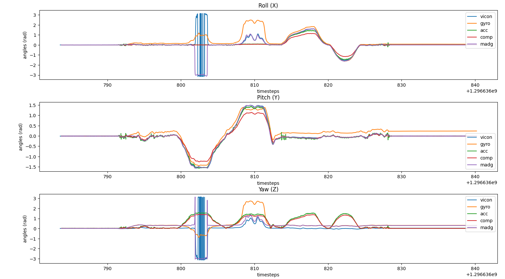
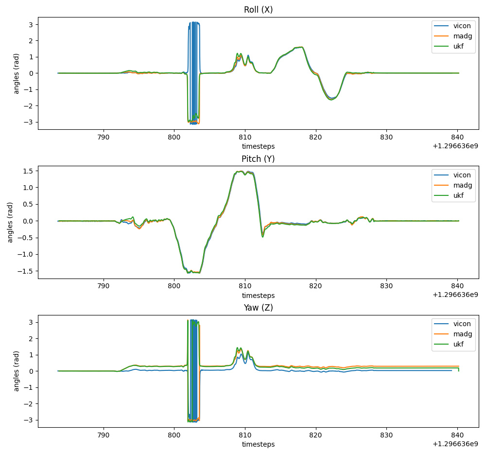
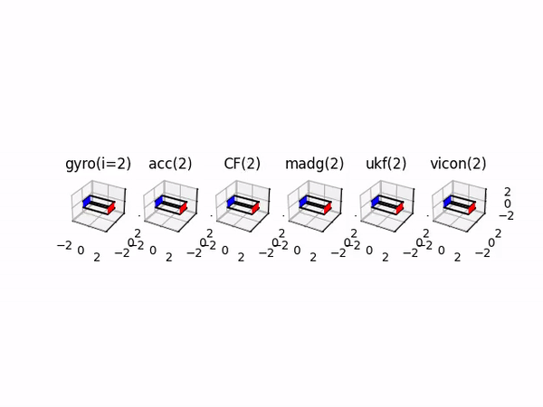

# 3D attitude estimation using various filters
Estimate the 3D orientation or attitude from 6 DOF IMU data (accelerometer and gyroscope) using only accelerometer data, only gyroscope data, a complimentary filter, a Madgwick filter, and an Unscented Kalman Filter. (Check the full problem statements here [project1a](https://rbe549.github.io/rbe595/fall2023/proj/p1a/) and [project1b](https://rbe549.github.io/rbe595/fall2023/proj/p1b/))
## Steps to run the code
- Install Numpy, Scipy, and Matplotlib libraries before running the code.
- To run on the first training data in the `Wrapper.py` file in the 'main' function set the variables as:
	IMU_filename = 'imuRaw1' and vicon_filename = 'viconRot1'
- For the other data change the variables accordingly and run the file.
- To generate 3D animations uncomment the specified lines in 'main' function. 
- In Code folder:
  ```
  python Wrapper.py
  ```

## Plots and Animations
For the train data 1, plots and animation showing roll, pitch, and yaw for all the filters:
<p float="middle">


</p>
<p float="middle">

</p>


## References
1. S. O. H. Madgwick, A. J. L. Harrison and R. Vaidyanathan, "Estimation of IMU and MARG orientation using a gradient descent algorithm," 2011 IEEE International Conference on Rehabilitation Robotics, Zurich, Switzerland, 2011, pp. 1-7, doi: 10.1109/ICORR.2011.5975346.
2. E. Kraft, "A quaternion-based unscented Kalman filter for orientation tracking," Sixth International Conference of Information Fusion, 2003. Proceedings of the, Cairns, QLD, Australia, 2003, pp. 47-54, doi: 10.1109/ICIF.2003.177425.

  
